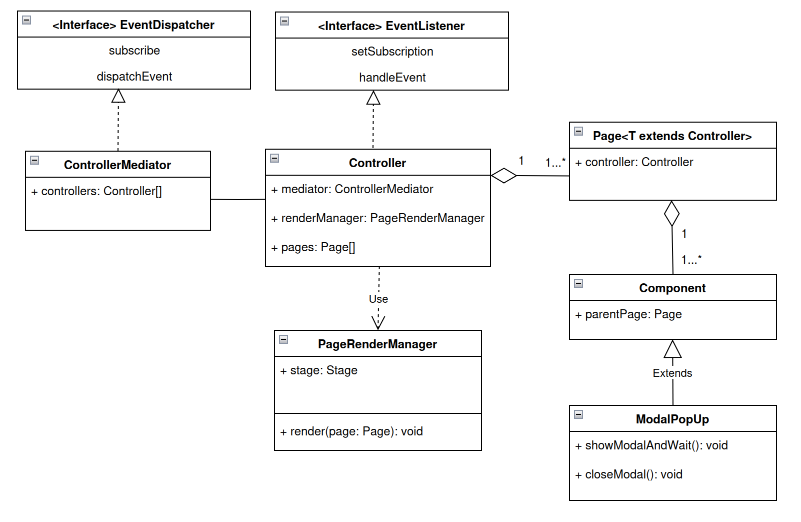

## Design pattern project
Goal: Implement a robust application in JavaFX using the design patterns to ensure the principle open/closed

#### How to run
```bash
mvn clean
mvn install
java -jar target/firstApplicationJFX-1.0-SNAPSHOT-shaded.jar
```

#### Architecture
Base of application (closed part)
